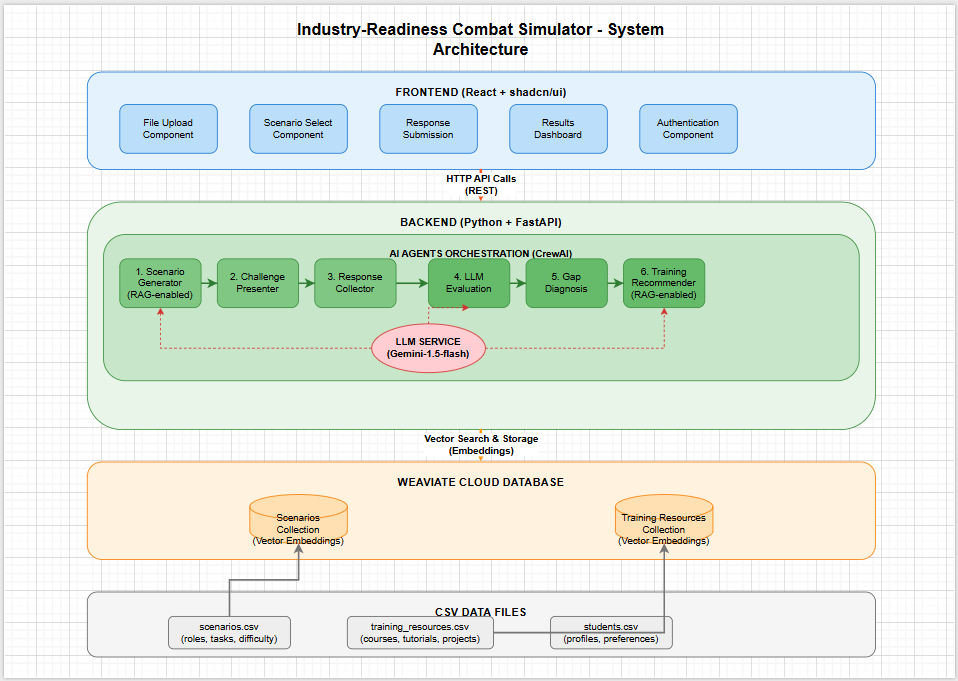

# Industry-Readiness Combat Simulator

🎯 **Project Overview**

The Industry-Readiness Combat Simulator is an AI-powered platform that helps final-year students assess their job readiness through realistic industry scenarios. The system uses 6 specialized AI agents working together to generate scenarios, evaluate responses, identify skill gaps, and recommend personalized training paths.

## 🏗️ System Architecture


## 🤖 AI Agents Architecture

### Agent 1: Scenario Generator Agent (RAG-enabled)
**File**: `backend/agents/scenario_generator_agent.py`

**Purpose**: Creates realistic job scenarios from industry knowledge base

**What it does**:
- **Receives Input**: Student role (frontend/backend/data_analyst/fullstack) + skill level
- **RAG Search**: Queries Weaviate Cloud for relevant industry scenarios  
- **LLM Generation**: Uses Gemini to create new scenarios based on retrieved context
- **Output**: 3 personalized scenarios with task descriptions, requirements, and success criteria

**Process Flow**:
```
Student Profile → RAG Search → Context Retrieval → LLM Generation → Scenario Creation
```

**Example Output**:
```json
{
  "id": "uuid-123",
  "role": "frontend",
  "title": "E-commerce Product Page",
  "task": "Create a responsive product page with add to cart functionality",
  "requirements": ["React components", "Responsive design", "State management"],
  "deliverables": ["Working product page", "Mobile-responsive design"],
  "criteria": ["Code quality", "User experience", "Performance"],
  "difficulty": "beginner"
}
```

### Agent 2: Challenge Presenter Agent
**File**: `backend/agents/challenge_presenter_agent.py`

**Purpose**: Adapts scenarios to match student skill level and requirements

**What it does**:
- **Receives Input**: Base scenario + student profile (skill level, role)
- **Complexity Adaptation**: Adjusts difficulty based on beginner/intermediate/advanced level
- **Constraint Setting**: Defines time limits and resource constraints
- **Instruction Generation**: Creates specific, actionable instructions
- **Output**: Customized challenge with adapted requirements

**Adaptation Logic**:
- **Beginner**: Step-by-step guidance, 2-hour time limit, basic requirements
- **Intermediate**: Some guidance, 1.5-hour time limit, additional requirements  
- **Advanced**: Minimal guidance, 1-hour time limit, complex optimization requirements

### Agent 3: Response Collector Agent
**File**: `backend/agents/response_collector_agent.py`

**Purpose**: Collects and validates student submissions

**What it does**:
- **Input Processing**: Receives student responses (code, documents, files)
- **Type Detection**: Automatically determines response type (code/document/design)
- **Validation**: Checks content integrity and completeness
- **Content Analysis**: Generates statistics (word count, code complexity, etc.)
- **Output**: Structured, validated response data ready for evaluation

### Agent 4: LLM Evaluation Agent
**File**: `backend/agents/evaluation_agent.py`

**Purpose**: Evaluates student responses using predefined rubrics

**What it does**:
- **Input Analysis**: Receives student response + original scenario requirements
- **Rubric Application**: Evaluates against 4 criteria (25 points each):
  - **Clarity**: Code readability, documentation quality
  - **Relevance**: Alignment with task requirements  
  - **Correctness**: Functional accuracy, error handling
  - **Scalability**: Performance considerations, design patterns
- **LLM Scoring**: Uses Gemini to provide detailed scores and feedback
- **Grade Calculation**: Converts scores to letter grades (A-F)

**Scoring System**:
- 90-100: Grade A (Excellent)
- 80-89: Grade B (Good)  
- 70-79: Grade C (Satisfactory)
- 60-69: Grade D (Needs Improvement)
- 0-59: Grade F (Unsatisfactory)

### Agent 5: Gap Diagnosis Agent
**File**: `backend/agents/gap_diagnosis_agent.py`

**Purpose**: Identifies specific skill gaps and areas for improvement

**What it does**:
- **Input Analysis**: Evaluation results + response content analysis
- **Gap Categorization**: Identifies gaps in three categories:
  - **Technical Gaps**: Implementation skills, technology knowledge
  - **Conceptual Gaps**: Understanding of principles and concepts
  - **Process Gaps**: Methodology, documentation, best practices
- **Priority Assessment**: Determines which gaps are most critical
- **Urgency Calculation**: Sets improvement urgency based on overall score

### Agent 6: Training Recommender Agent (RAG-enabled)
**File**: `backend/agents/training_recommender_agent.py`

**Purpose**: Recommends personalized learning resources based on identified gaps

**What it does**:
- **Gap Analysis Input**: Receives categorized skill gaps from diagnosis agent
- **RAG Resource Search**: Queries Weaviate Cloud for relevant training materials
- **Resource Categorization**: Organizes by priority and type:
  - **Immediate**: Critical skills needing urgent attention
  - **Foundational**: Core concepts and understanding
  - **Practical**: Hands-on projects and exercises
  - **Advanced**: Enhancement and optimization skills
- **Learning Path Creation**: Structures resources into progressive phases
- **Duration Estimation**: Calculates time needed for improvement

**Learning Path Structure**:
- **Phase 1**: Critical Skills (1-2 weeks)
- **Phase 2**: Foundation Building (2-3 weeks)  
- **Phase 3**: Practical Application (2-4 weeks)
- **Phase 4**: Advanced Development (3-4 weeks)

## 📊 Data Flow Process

### Complete Simulation Workflow:
1. **Student Profile Input**
2. **CSV Data Upload** (Scenarios + Training Resources)
3. **Scenario Generator Agent** (RAG Search + LLM Generation)
4. **Challenge Presenter Agent** (Difficulty Adaptation)  
5. **Student Response Submission**
6. **Response Collector Agent** (Validation + Analysis)
7. **Evaluation Agent** (Rubric-based Scoring)
8. **Gap Diagnosis Agent** (Skill Gap Identification)
9. **Training Recommender Agent** (RAG-based Recommendations)
10. **Results Dashboard Display**

### Agent Interaction Flow:
```
┌─────────────────┐    ┌─────────────────┐    ┌─────────────────┐
│   CSV Upload    │───▶│  Vector Store   │───▶│ RAG-enabled     │
│   (Scenarios &  │    │   (Weaviate)    │    │ Agents (1 & 6)  │
│   Resources)    │    │                 │    │                 │
└─────────────────┘    └─────────────────┘    └─────────────────┘
                                                        │
                                                        ▼
┌─────────────────┐    ┌─────────────────┐    ┌─────────────────┐
│   Gemini LLM    │◀───│  Agent Pipeline │◀───│  Student Input  │
│   (Processing)  │    │  (CrewAI)       │    │  (Profile +     │
│                 │    │                 │    │   Response)     │
└─────────────────┘    └─────────────────┘    └─────────────────┘
         │                       │
         ▼                       ▼
┌─────────────────┐    ┌─────────────────┐
│  Evaluation &   │    │   Training      │
│  Gap Analysis   │    │ Recommendations │
│                 │    │                 │
└─────────────────┘    └─────────────────┘
```

## 🗂️ Project Structure

```
industry-readiness-simulator/
├── README.md                          # This file
├── .env                              # Environment variables
│
├── frontend/                         # React Application
│   ├── src/
│   │   ├── components/
│   │   │   ├── ui/                   # shadcn/ui components
│   │   │   ├── FileUpload.jsx        # CSV upload interface
│   │   │   ├── ScenarioSelector.jsx  # Student profile & scenario selection
│   │   │   ├── ResponseSubmission.jsx # Solution submission form
│   │   │   └── ResultsDashboard.jsx  # Results display with recommendations
│   │   ├── pages/
│   │   │   ├── Home.jsx              # Landing page
│   │   │   └── Simulator.jsx         # Main assessment interface
│   │   ├── hooks/
│   │   │   └── useApi.js             # API integration hooks
│   │   ├── utils/
│   │   │   └── api.js                # API client
│   │   ├── App.jsx                   # Main app component
│   │   └── main.jsx                  # Entry point
│   ├── package.json
│   └── vite.config.js
│
├── backend/                          # Python Backend
│   ├── agents/                       # AI Agents
│   │   ├── scenario_generator_agent.py    # Agent 1: Scenario generation
│   │   ├── challenge_presenter_agent.py   # Agent 2: Challenge adaptation
│   │   ├── response_collector_agent.py    # Agent 3: Response validation
│   │   ├── evaluation_agent.py            # Agent 4: LLM evaluation
│   │   ├── gap_diagnosis_agent.py         # Agent 5: Gap analysis
│   │   └── training_recommender_agent.py  # Agent 6: Training recommendations
│   │
│   ├── crew/                         # CrewAI Orchestration
│   │   ├── simulator_crew.py         # Main orchestration logic
│   │   └── tasks.py                  # Task definitions
|   ├── resource/                         # CrewAI Orchestration
│   │   ├── scenarios.csv        # Csv file for upload
│   │   └── training_resources.csv                  # Csv file for upload
│   │
│   ├── database/                     # Weaviate Integration
│   │   ├── weaviate_client.py        # Cloud connection
│   │   ├── vector_store.py           # Vector operations
│   │   └── data_loader.py            # CSV processing
│   │
│   ├── models/                       # Data Models
│   │   ├── scenario.py               # Scenario data structures
│   │   ├── student.py                # Student profiles
│   │   ├── response.py               # Response & evaluation models
│   │   └── evaluation.py             # Evaluation results
│   │
│   ├── services/                     # Business Logic
│   │   ├── csv_processor.py          # CSV file processing
│   │   ├── llm_service.py            # Gemini LLM integration
│   │   └── orchestrator.py           # Agent coordination
│   │
│   ├── api/                          # FastAPI Routes
│   │   ├── main.py                   # Main API application
│   │   └── routes/                   # API endpoints
│   │
│   ├── config/                       # Configuration
│   │   ├── settings.py               # Environment settings
│   │   └── prompts.py                # LLM prompts
│   │
│   ├── data/                         # CSV Data Storage
│   │   ├── scenarios/                # Scenario CSV files
│   │   ├── students/                 # Student data (optional)
│   │   └── training_resources/       # Training resource CSVs
│   │
│   ├── requirements.txt              # Python dependencies
│   └── main.py                       # Backend entry point
│
└── csv_templates/                    # Sample CSV files
    ├── scenarios.csv
    ├── training_resources.csv
    └── students.csv
```

## 📋 CSV File Requirements

### 1. scenarios.csv
**Purpose**: Contains job scenarios for different roles and difficulty levels

**Required Columns**:
- `role`: Job role (frontend, backend, data_analyst, fullstack)
- `title`: Short scenario title
- `task`: Detailed task description  
- `difficulty`: Skill level (beginner, intermediate, advanced)
- `context`: Additional context or background information

### 2. training_resources.csv
**Purpose**: Contains learning resources for skill improvement

**Required Columns**:
- `title`: Resource title
- `type`: Resource type (course, tutorial, project, documentation, book)
- `description`: Brief description of the resource
- `url`: Link to the resource (use # for placeholder)
- `skills`: Comma-separated skills covered

### 3. students.csv (Optional)
**Purpose**: Pre-defined student profiles for testing

**Required Columns**:
- `id`: Unique student identifier
- `name`: Student name
- `role`: Preferred job role
- `skill_level`: Current skill level
- `email`: Contact email (optional)

## 🚀 Installation & Setup

### Prerequisites
- Python 3.12.7
- Node.js 18+
- Git
- VS Code (recommended)

### Environment Setup

1. **Clone or create the project structure**:
```bash
mkdir industry-readiness-simulator
cd industry-readiness-simulator
```

2. **Set up environment variables**:
Create `.env` file in project root:
```env
GOOGLE_API_KEY=your_gemini_api_key_here
WEAVIATE_URL=https://your-cluster.weaviate.cloud
WEAVIATE_API_KEY=your_weaviate_api_key
CORS_ORIGINS=http://localhost:5173
```

3. **Backend setup**:
```bash
cd backend
python -m venv venv
source venv/bin/activate  # Windows: venv\Scripts\activate
pip install -r requirements.txt
```

4. **Frontend setup**:
```bash
cd frontend
npm install
```

### Starting the Application

**Option 1: Using startup script**
```bash
chmod +x start.sh
./start.sh
```

**Option 2: Manual startup**
```bash
# Terminal 1: Backend
cd backend
source venv/bin/activate
python main.py

# Terminal 2: Frontend  
cd frontend
npm run dev
```

### Accessing the Application
- **Frontend**: http://localhost:5173
- **Backend API**: http://localhost:8000
- **API Documentation**: http://localhost:8000/docs

## 📄 CSV Templates

### scenarios.csv
```csv
role,title,task,difficulty,context
frontend,E-commerce Product Page,Create a responsive product page with add to cart functionality,beginner,Build a product display page for an online store with shopping cart integration
frontend,React Dashboard,Build a data visualization dashboard using React and charts,intermediate,Create an analytics dashboard for business metrics and KPI tracking
frontend,Advanced UI Library,Develop a reusable component library with TypeScript,advanced,Build scalable component system for enterprise applications
backend,REST API for Blog,Design and implement a REST API for a blogging platform,beginner,Build backend services for a content management system with CRUD operations
backend,Microservices Architecture,Design a microservices system for an e-commerce platform,advanced,Scale backend services for high-traffic applications with distributed architecture
backend,Authentication System,Implement secure user authentication and authorization,intermediate,Build secure login system with JWT tokens and role-based access control
data_analyst,Sales Data Analysis,Analyze quarterly sales data and identify trends,beginner,Examine business performance using statistical methods and data visualization
data_analyst,Customer Segmentation,Perform customer segmentation using machine learning,intermediate,Use clustering algorithms to identify customer groups for targeted marketing
data_analyst,Predictive Analytics,Build predictive models for business forecasting,advanced,Create machine learning models for revenue prediction and risk assessment
fullstack,Social Media App,Build a complete social media application,advanced,Create end-to-end social networking platform with real-time features
fullstack,Task Management System,Develop a project management tool,intermediate,Build collaborative workspace with task tracking and team features
fullstack,E-learning Platform,Create an online education platform,advanced,Develop comprehensive learning management system with video streaming
```

### training_resources.csv
```csv
title,type,description,url,skills
React Fundamentals Course,course,Learn React basics from scratch with hands-on projects,#,React JavaScript frontend components
Node.js Backend Development,course,Complete backend development with Node.js and Express,#,Node.js backend API Express JavaScript
Python for Data Analysis,course,Data analysis using pandas numpy and matplotlib,#,Python data analysis pandas numpy matplotlib
SQL Database Design,tutorial,Learn database design principles and optimization,#,SQL database design normalization optimization
Git Version Control,tutorial,Master Git for version control and collaboration,#,Git version control collaboration branching
JavaScript ES6+ Features,tutorial,Modern JavaScript programming with latest features,#,JavaScript ES6 programming async promises
REST API Best Practices,documentation,Guidelines for designing scalable REST APIs,#,API REST backend design HTTP methods
React Portfolio Project,project,Build a professional portfolio website with React,#,React project portfolio components styling
Data Visualization with D3,course,Create interactive charts and graphs with D3.js,#,D3 visualization charts SVG JavaScript
Docker Containerization,tutorial,Learn Docker for application deployment,#,Docker containers deployment DevOps
MongoDB Database,course,NoSQL database design and operations with MongoDB,#,MongoDB NoSQL database aggregation indexing
Python Machine Learning,course,Machine learning with scikit-learn and TensorFlow,#,Python machine learning scikit-learn TensorFlow
TypeScript Fundamentals,tutorial,Add type safety to JavaScript applications,#,TypeScript JavaScript types interfaces
AWS Cloud Services,course,Cloud deployment and services with Amazon Web Services,#,AWS cloud deployment serverless S3
CSS Grid and Flexbox,tutorial,Modern CSS layout techniques for responsive design,#,CSS layout responsive design Grid Flexbox
Redux State Management,tutorial,Manage application state with Redux and Redux Toolkit,#,Redux state management React JavaScript
Express.js Framework,tutorial,Build web applications with Express.js framework,#,Express.js Node.js backend middleware routing
Pandas Data Processing,tutorial,Data manipulation and analysis with pandas library,#,pandas Python data processing cleaning analysis
GraphQL API Development,course,Build flexible APIs with GraphQL and Apollo,#,GraphQL API backend Apollo Node.js
Jupyter Notebooks,tutorial,Interactive data science with Jupyter notebooks,#,Jupyter Python data science notebooks analysis
```

## 🔧 Configuration

### Environment Variables
- `GOOGLE_API_KEY`: Your Google Gemini API key
- `WEAVIATE_URL`: Your Weaviate Cloud cluster URL
- `WEAVIATE_API_KEY`: Your Weaviate Cloud API key
- `CORS_ORIGINS`: Allowed frontend origins (comma-separated)

### Customization Options
- **Add new roles**: Modify role enums in `models/scenario.py`
- **Adjust scoring rubrics**: Update prompts in `config/prompts.py`
- **Modify evaluation criteria**: Change scoring logic in `evaluation_agent.py`
- **Add new resource types**: Extend training resource categories

## 🧪 Testing

### Quick Test Workflow

1. Start the application
2. Upload sample CSV files (provided above)
3. Create a student profile:
   - Name: Test Student
   - Role: Frontend
   - Skill Level: Beginner
4. Generate scenarios and select one
5. Submit a sample response:
```javascript
function ProductPage() {
  const [cartItems, setCartItems] = useState([]);
  
  const addToCart = (product) => {
    setCartItems([...cartItems, product]);
  };
  
  return (
    <div className="product-page">
      <h1>Product Title</h1>
      <button onClick={() => addToCart(product)}>
        Add to Cart
      </button>
    </div>
  );
}
```
6. View evaluation results and training recommendations

### Expected Results
- Evaluation scores for clarity, relevance, correctness, scalability
- Skill gap identification in technical, conceptual, and process areas
- Personalized learning path with 4 phases of improvement
- Resource recommendations tailored to identified gaps
